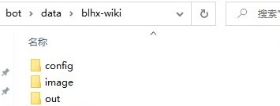
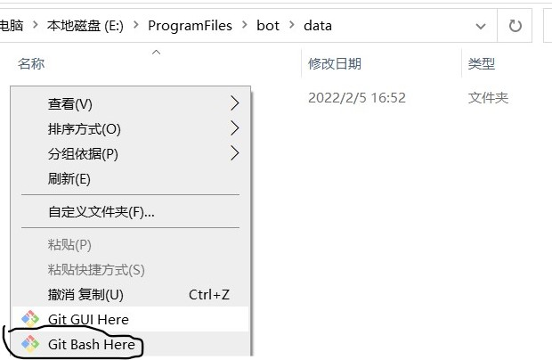
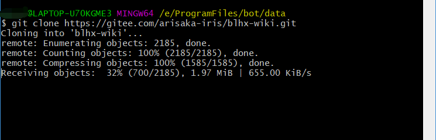
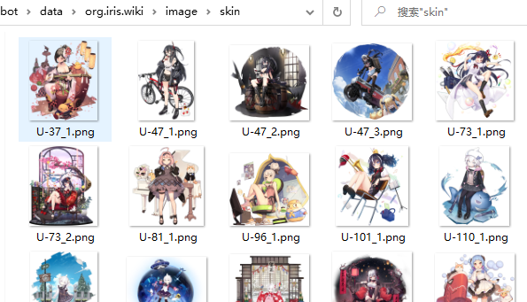

# 碧蓝航线wiki群聊机器人插件数据文件

插件地址：https://gitee.com/arisaka-iris/blhx-wiki-mirai-plugin

此数据请放在data目录下，如下图所示

## 详细使用教程

### 1.安装mirai console

- 下载[安装文件](https://github.com/mamoe/mirai/blob/dev/docs/UserManual.md)

  

- 下载最新的稳定版本的安装文件，根据系统选择，windows系统安装文件如下：

  

  

- 将安装文件移动到自己想要安装的路径下，运行安装文件

- 询问是否安装java，输入y回车，版本选择直接回车使用默认版本

  

- 输入y安装MCL

  

- 安装完成后文件目录如下所示

  

- 运行mcl.cmd，第一次运行会自动下载必须依赖库，出现此界面代表下载成功（报错可以删除plugin和libs文件夹重新下载）

  

  

- 使用 `autologin add qq号 密码` 添加自动登录账号

  

- 重新启动mcl.cmd，进行登录验证，出现以下内容代表登录成功

  

### 2.下载插件jar包

- 下载本项目最新[jar包](https://gitee.com/arisaka-iris/blhx-wiki-mirai-plugin/releases)，放在MCL目录的plugin下

  

### 3.下载数据文件

- 推荐使用[git](https://git-scm.com/download/win)下载本项目数据文件，以方便数据文件更新

- 安装完成之后在MCL的data目录下右键，选择`git bash here`

  

- 输入`git clone https://github.com/DK09/blhx-wiki.git`

  

- clone完成后确保数据文件路径如下所示

  

### 3.5. 下载皮肤大图

*不需要查询皮肤大图可以不下载

- 下载[皮肤文件](https://pan.baidu.com/s/1yX70ob1A6RXncDbei7-ldA?pwd=txa2)中最新的完整包以及在完整包日期之后的更新包

- 解压皮肤图片至`data/org.iris.wiki/image/skin`，如下图所示

  

### 4. 运行mcl.cmd,测试功能

- 运行mcl.cmd，新版本MCL会自动将数据文件夹`blhx-wiki`重命名为`org.iris.wiki`

  
- 测试列表中的功能，如果没有报错，机器人部署成功

- 缓存放在`data/blhx-wiki/out`文件夹下，可以定期清理

  

### 5.数据文件更新

- 若使用git clone方式下载数据文件，可以在数据文件夹`data/blhs-wiki或data/org.iris.wiki`下，右键选择git bash here，输入`git pull origin master`来更新数据文件

  
